# Store Management System

### Home Page

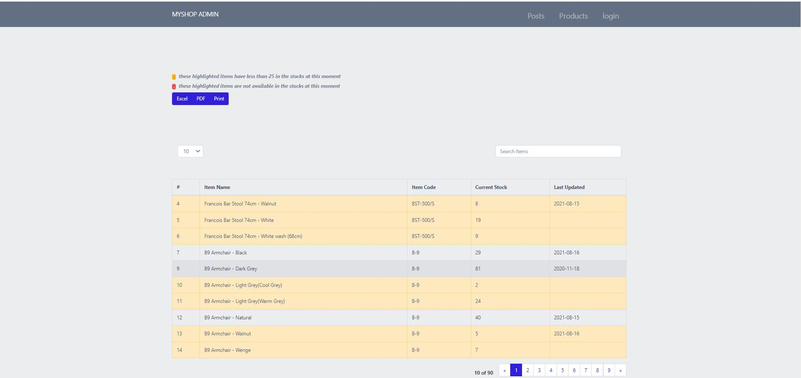

**Posts**

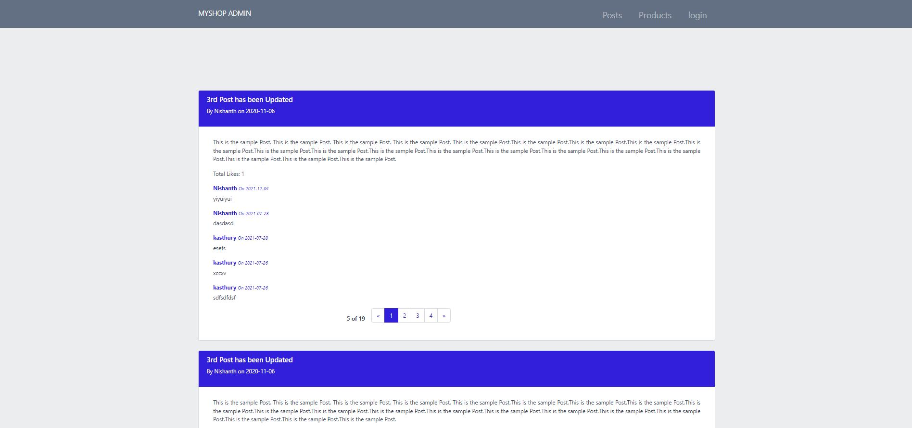

### Login

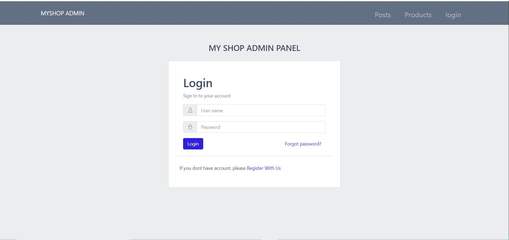

### Registrationa

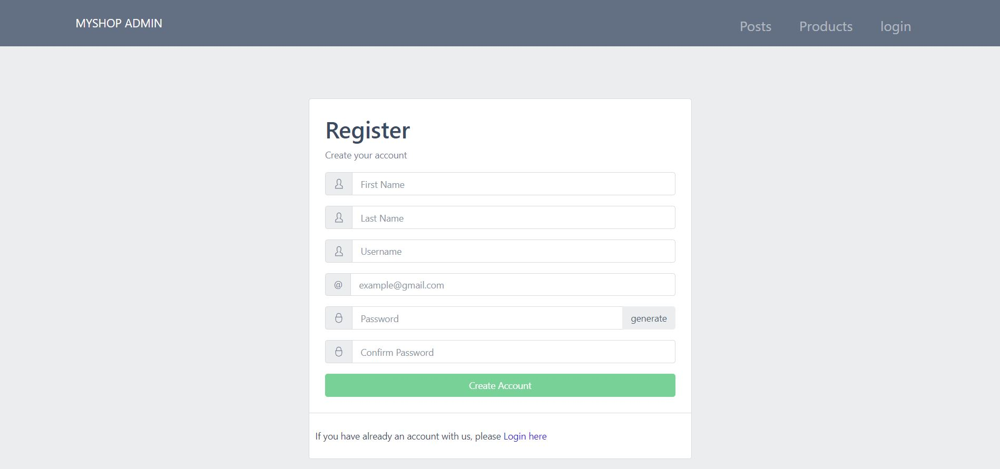

# ADMIN

### Dashboard

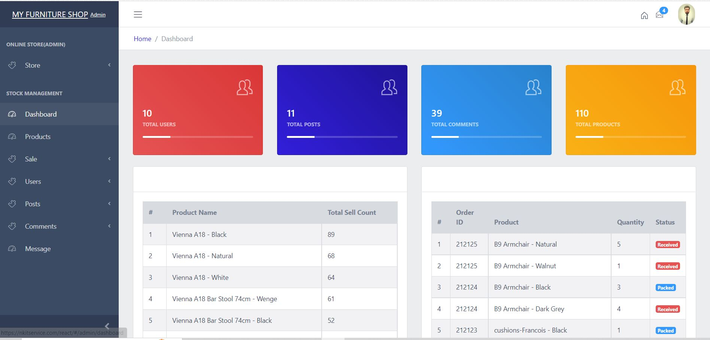

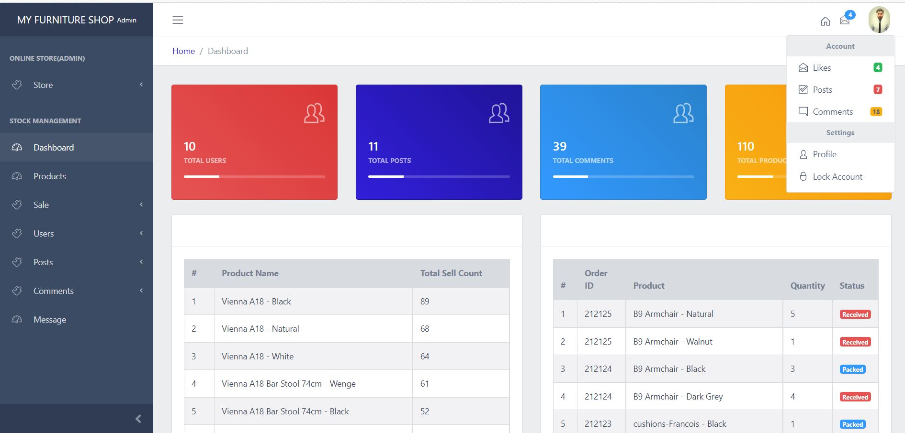

### STOCK MANAGEMENT

## PRODUCTS

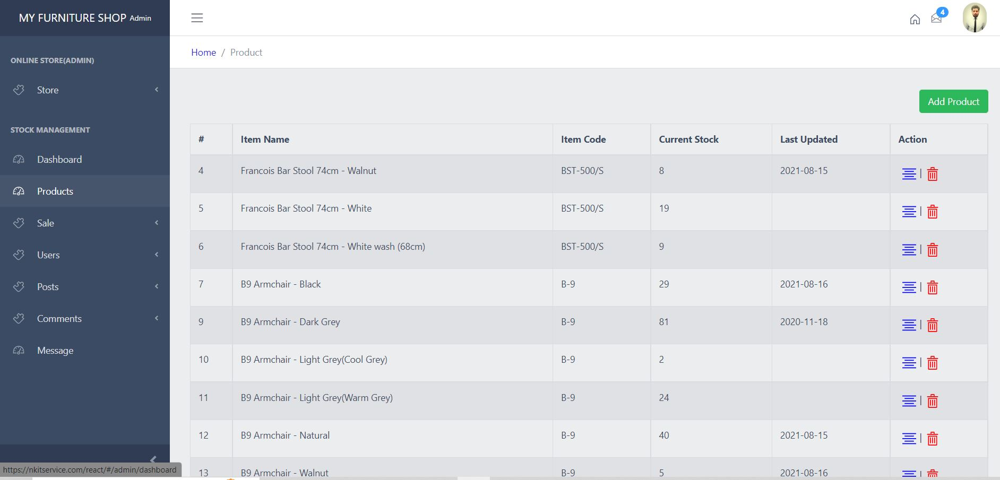

** Add Products **

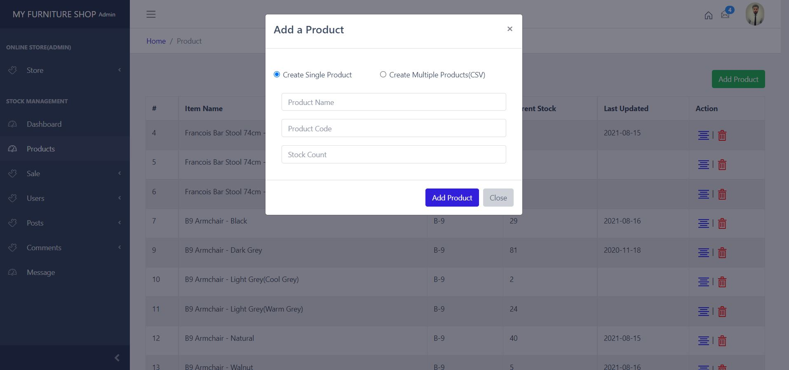

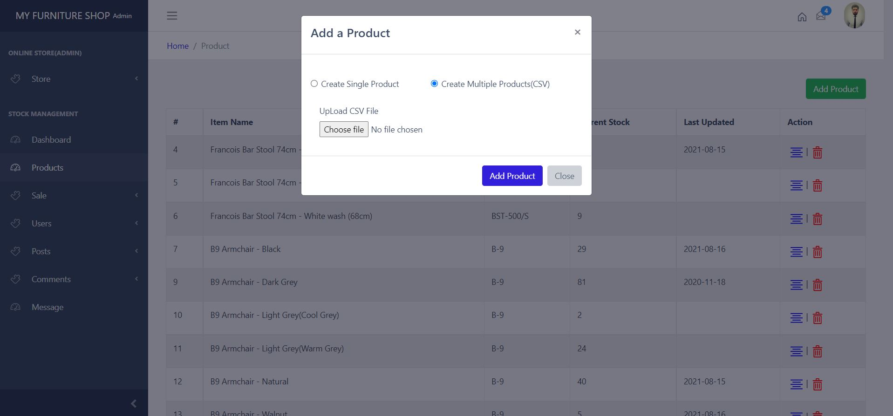

** Update Products **

** Delete Products **

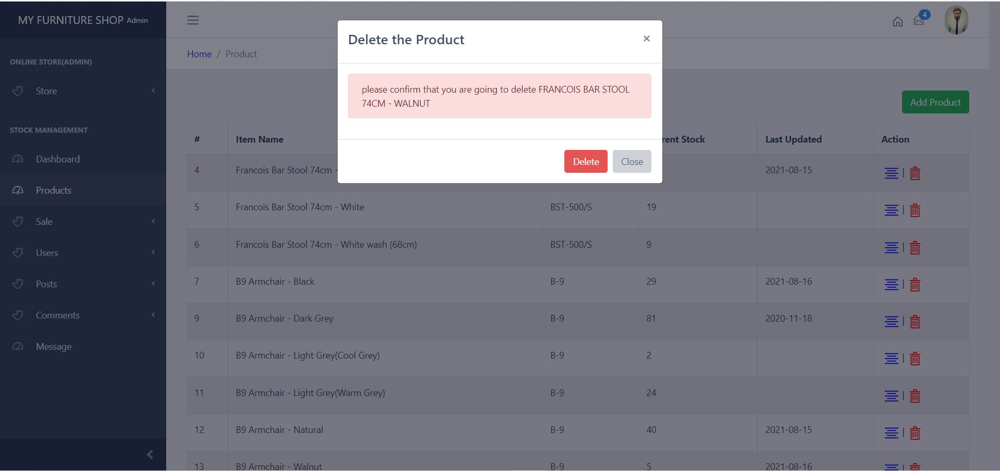

## ORDERS

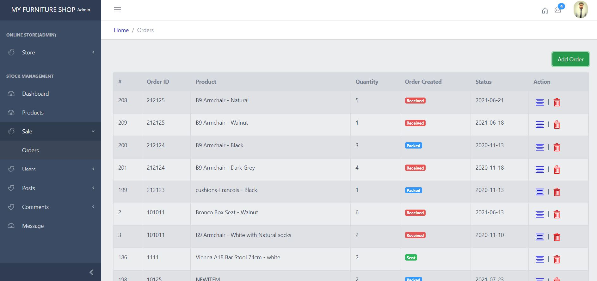

** Create Orders **

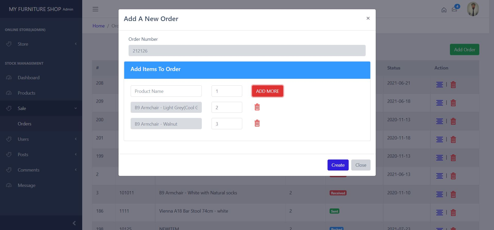

** Update Orders **

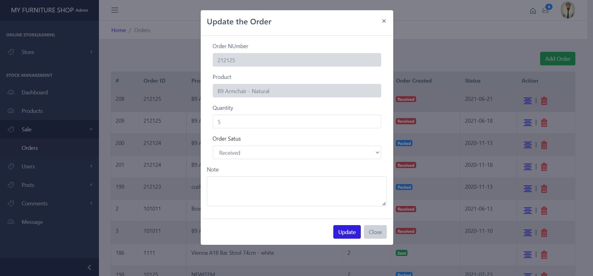

** Delete Orders **

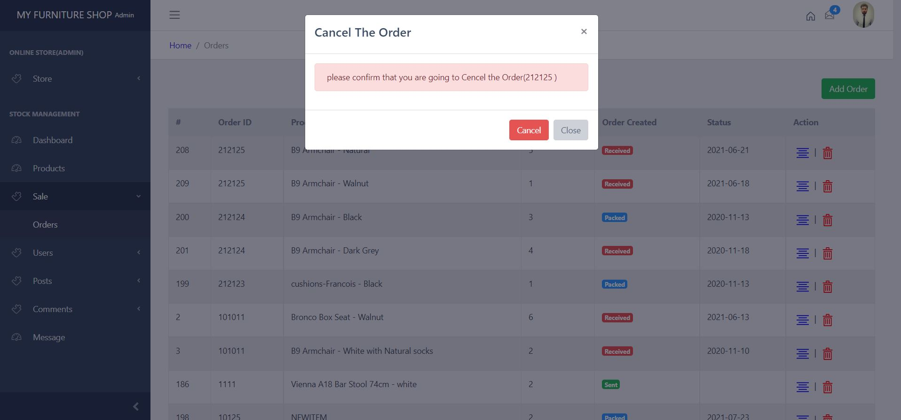

## USERS

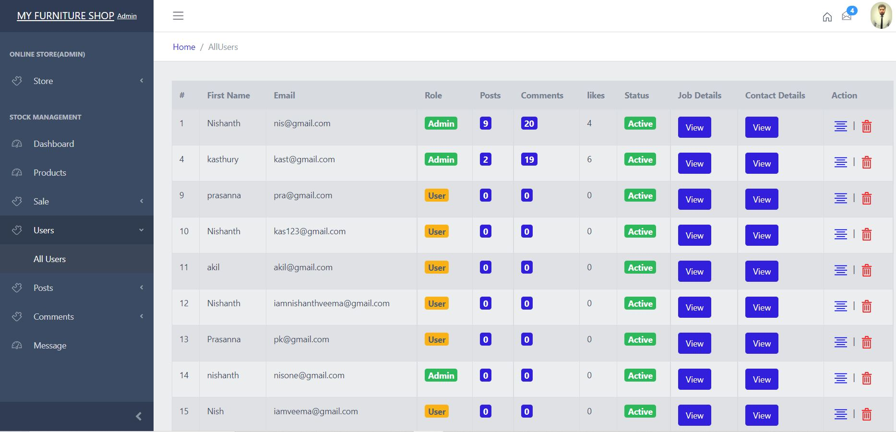

## POSTS

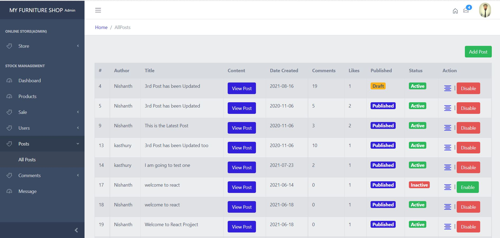

** Add Posts **

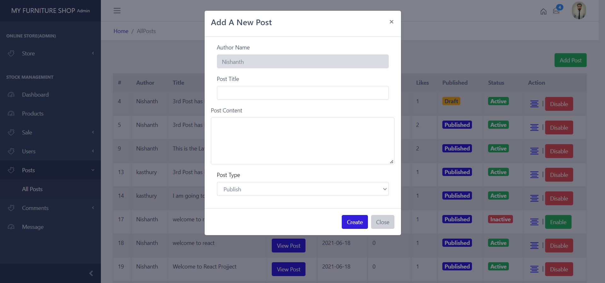

** Update Posts **

