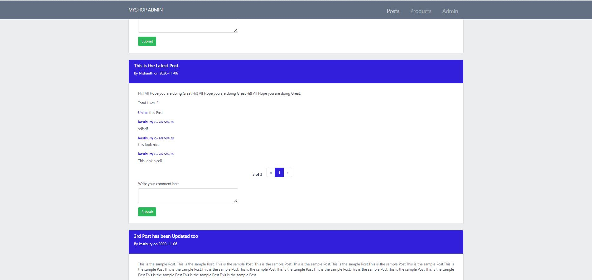
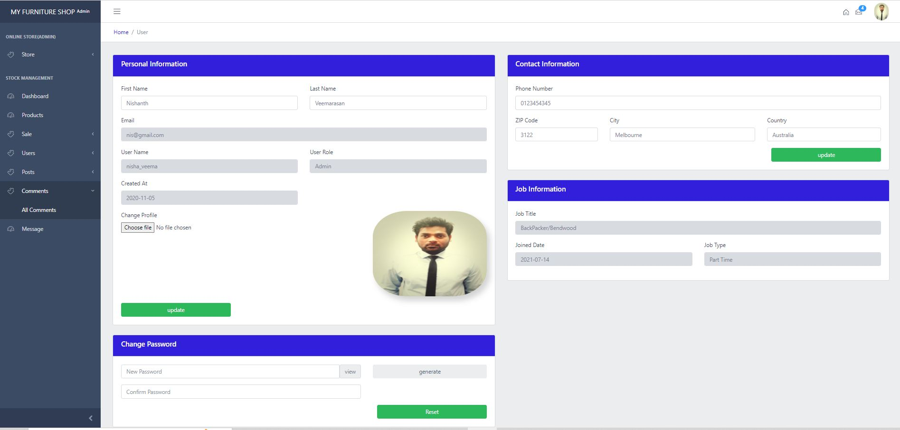
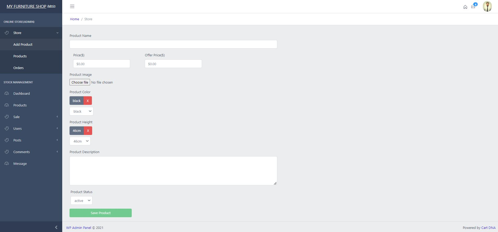
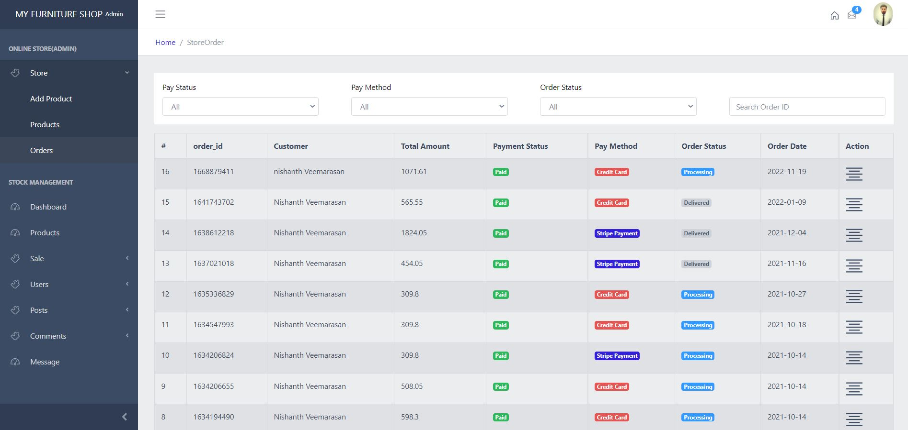
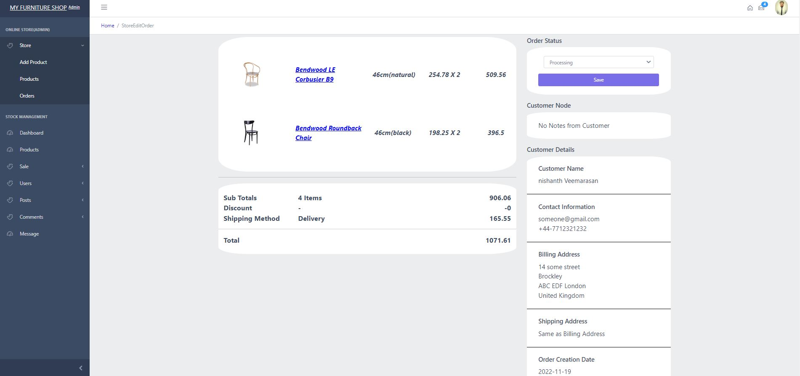
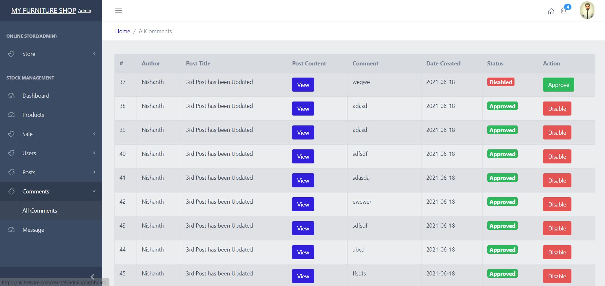

# Store Management System

### Home Page

**Posts**

### Login

### Registration

# ADMIN

### ADD COMMENTS TO POSTS

### Dashboard

**Add Products**

## ONLINE STORE MANAGEMENT

### ONLINE STORE ACTIVE PRODUCTS

### ADD PRODUCTS TO ONLINE STORE

### UPDATE ONLINE STORE ACTIVE PRODUCTS

### INVOICES

**Update Invoices**

## STOCK MANAGEMENT

## PRODUCTS

**Add Products**

**Update Products**

**Delete Products**

## ORDERS

**Create Orders**

**Update Orders**

**Delete Orders**

## USERS

## POSTS

**Add Posts**

**Update Posts**

## COMMENTS

